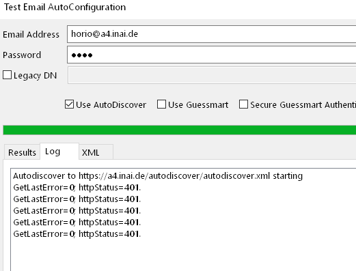

..
        SPDX-License-Identifier: CC-BY-SA-4.0 or-later
        SPDX-FileCopyrightText: 2022 grommunio GmbH

Autodiscover
============

In the Windows taskbar, in the notification area, there is an Outlook icon.
When this icon is Ctrl-right click, it brings up a service menu, and "Test
Autodiscover" is one of the commands.

In this Autodiscover test dialog, if the discovery reports HTTP error 401
Unauthorized, the cause is because that dialog stupidly uses an old saved
password and not the contents of the password field.

An alternative way to validate Autodiscover request & responses is to use the
Gromox command-line utility ``PASS=abcd gromox-dscli -e user@domain``.
