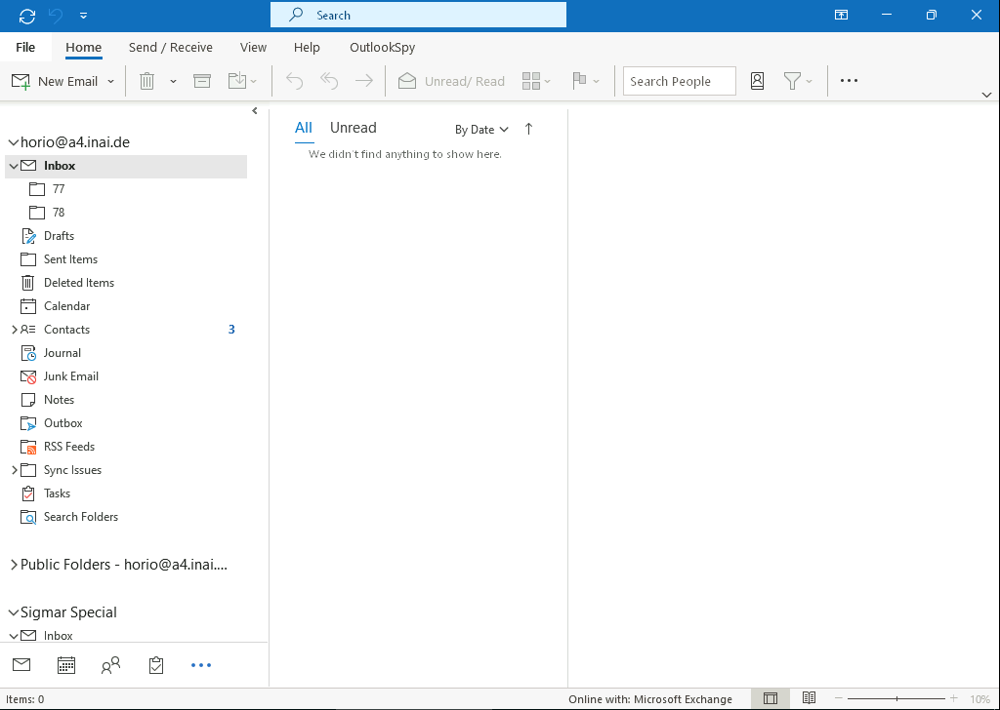
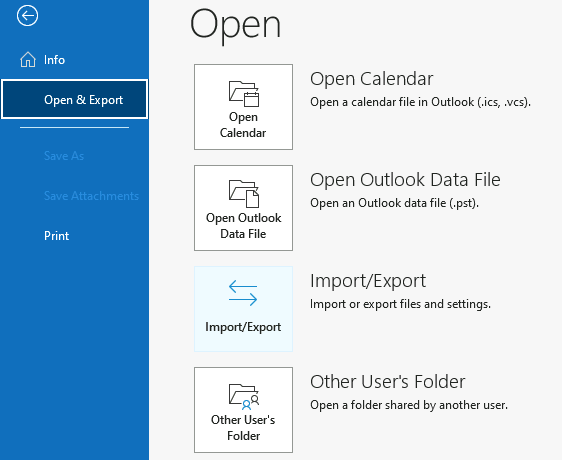
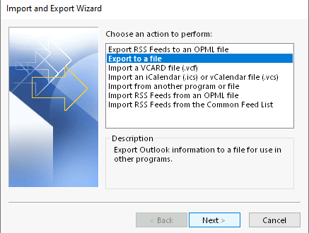
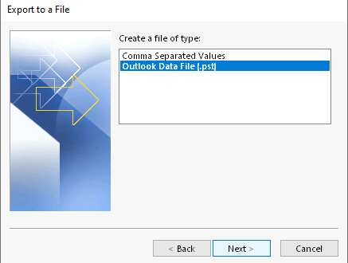
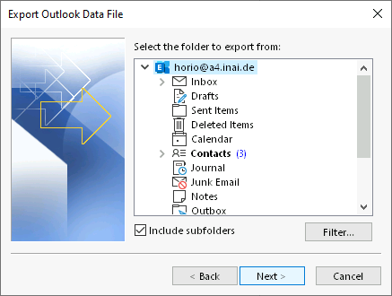
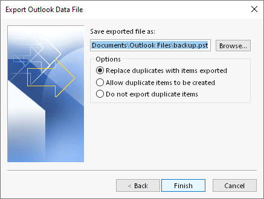
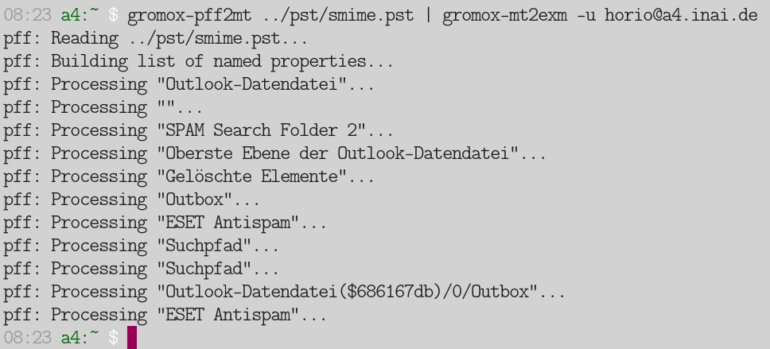
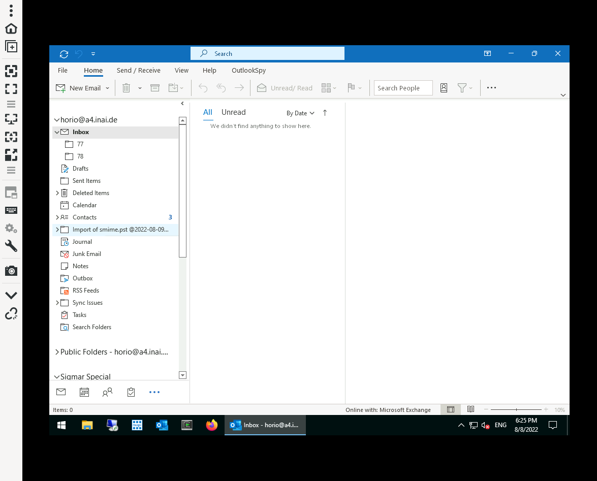

##################
Microsoft Exchange
##################

PFF (cf. `summary from the Forensics Wiki
<https://forensicswiki.xyz/wiki/index.php?title=Personal_Folder_File_(PAB,_PST,_OST)>`_)
is a format exportable from Outlook and Exchange. Outlook makes use of this
format for different scenarios, and calls them different names (`.pst`,
`.ost`), but it is just one file type.

* `.pst` files can be generated with Outlook interactively
* `.ost` files can be taken from `C:\Users\...`
* `.pst` files can be also generated from an Exchange Server's PowerShell in a
  mostly unattended fashion

Outlook interactive export
==========================

Once the Outlook main window is open, go to “File”, “Open & Export”,
“Import/Export”:

Then follow the usual dialog chain.

gromox-pff2mt import
====================

On the grommunio system, PFF files can be imported on the command-line with
`gromox-pff2mt </man/gromox-pff2mt.8gx.html>`_ and `gromox-mt2exm
</man/gromox-mt2exm.8gx.html>`_. These are two commands meant to be chained
together by way of a pipe; tend to the linked manual pages to read about the
invocation syntax.

Exchange PowerShell export
==========================

Contributors have written `a PowerShell script
<https://github.com/grommunio/gromox/blob/master/tools/exchange2grommunio.ps1>`_
for the mass export of .pst files from an Exchange Management Console (a
PowerShell instance with Exchange commands loaded) with a subsequent mass
import via ssh commands that it issues. Inspect the first 130 or so lines of
the script for **mandatory adjustable parameters**.
